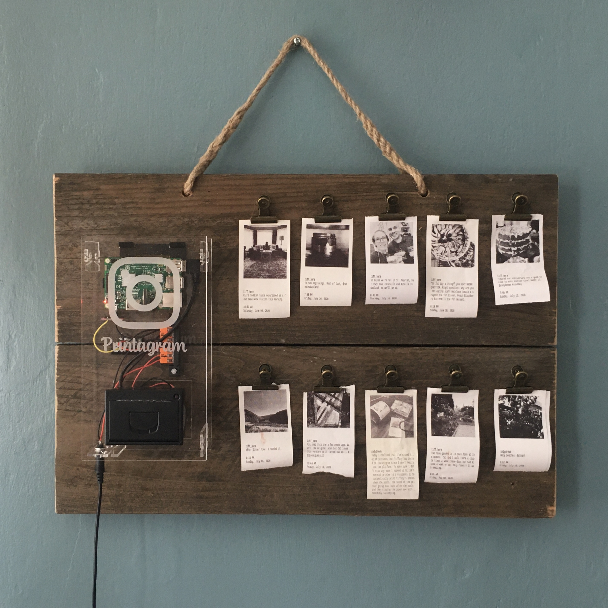
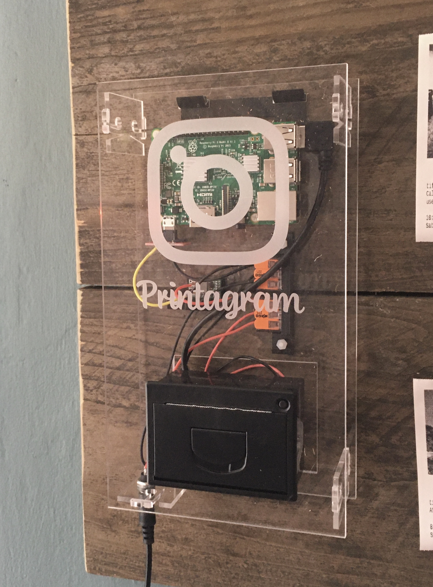

# printagram
I didn't know how often my wife posts photos to instagram. One random day I happend to be on and saw dozens of great photos I'd never seen before. I didn't want to have to check instagram regularly to see her photos so I decided to do something. Introducing my instagram printer.

 

Printagram checks authenticated accounts regularly for new posts. When a new post is detected, it prints the first photo, date, time, and caption. The printer is a thermal receipt printer.

## Components:
* Raspberry pi ($35): https://www.adafruit.com/product/3055
* Tiny thermal receipt printer ($50): https://www.adafruit.com/product/2751
* Snap action 3-wire connectors ($3): https://www.adafruit.com/product/866
* 9V power supply ($10): https://www.amazon.com/gp/product/B07KVYZVV4
* Panel mount 5.5mm DC barrel connector ($8 for 10): https://www.amazon.com/gp/product/B01N8VV78D/
* DC step-down transformer and power regulator ($9 for 5): https://www.amazon.com/gp/product/B0758ZTS61/
* Bulldog clips ($12 for 40): https://www.amazon.com/gp/product/B07NRWY47P/
* A laser cut acrylic case (cutting svg included in case directory)
* 3D printed brackets, holders etc. (3dm and stl files included in case directory)
* Scrap wood, jute rope, and silicone cover wire, and small wood screws from the basement.
